# Socket.IO Selgitus ja Arhitektuuridiagramm

## Mis on Socket.IO?

Socket.IO on JavaScript teek, mis võimaldab **reaalajas kahesuunalist suhtlust** (bidirectional communication) veebirakenduste ja serveri vahel. Erinevalt tavalisest HTTP-st, kus klient peab alati päringu tegema, võib Socket.IO server **saata andmeid klientidele automaatselt**.

### Põhilised mõisted:

1. **Socket** - Ühendus klient ja serveri vahel
2. **Emit** - Sündmuse saatmine (nii klient kui server saavad saata)
3. **On** - Sündmuse kuulamine (nii klient kui server saavad kuulata)
4. **Room** - Grupp kliente, kellele saadetakse sündmused (meie projektis ei kasuta)

## Kuidas see töötab meie projektis?

### 1. Ühenduse loomine

```
Klient (brauser)                    Server
     |                                  |
     |--- io() (ühenduse loomine) ---->|
     |                                  |
     |<-- 'connect' sündmus -----------|
     |                                  |
```

**Kood:**
```javascript
// socket-client.js
socket = io();  // Loob ühenduse serveriga

socket.on('connect', () => {
    console.log('Socket.IO connected');
});
```

### 2. Sündmuste saatmine ja kuulamine

```
Klient                              Server
     |                                  |
     |--- emit('subscribe-leaderboard', raceId) -->|
     |                                  |
     |                                  | (töötleb päringu)
     |                                  |
     |<-- emit('leaderboard', data) ---|
     |                                  |
```

**Kood näide:**
```javascript
// Klient saadab
socket.emit('subscribe-leaderboard', 1);

// Server kuulab ja vastab
socket.on('subscribe-leaderboard', (raceId) => {
    const leaderboard = getLeaderboard(raceId);
    socket.emit('leaderboard', leaderboard);
});

// Klient kuulab vastust
socket.on('leaderboard', (data) => {
    displayLeaderboard(data);
});
```

## Arhitektuuridiagramm - Racetrack3 projekt

```mermaid
graph TB
    subgraph "Server (server.js)"
        S[Socket.IO Server]
        API[Express API]
        DB[(Mälus andmed<br/>races, laps)]
    end
    
    subgraph "Klient 1: Front Desk"
        FD[front-desk.html]
        FD_JS[front-desk.js]
        FD_SOCKET[Socket Klient]
    end
    
    subgraph "Klient 2: Race Control"
        RC[race-control.html]
        RC_JS[race-control.js]
        RC_SOCKET[Socket Klient]
    end
    
    subgraph "Klient 3: Lap-line Tracker"
        LT[lap-line-tracker.html]
        LT_JS[lap-line-tracker.js]
        LT_SOCKET[Socket Klient]
    end
    
    subgraph "Klient 4: Leader Board"
        LB[leader-board.html]
        LB_JS[leader-board.js]
        LB_SOCKET[Socket Klient]
    end
    
    subgraph "Klient 5: Race Countdown"
        CD[race-countdown.html]
        CD_JS[race-countdown.js]
        CD_SOCKET[Socket Klient]
    end
    
    %% Ühendused
    FD_SOCKET <-->|Socket.IO| S
    RC_SOCKET <-->|Socket.IO| S
    LT_SOCKET <-->|Socket.IO| S
    LB_SOCKET <-->|Socket.IO| S
    CD_SOCKET <-->|Socket.IO| S
    
    FD_JS -->|HTTP API| API
    RC_JS -->|HTTP API| API
    LT_JS -->|HTTP API| API
    
    API --> DB
    S --> DB
    
    %% Sündmused
    S -.->|'race-update'| FD_SOCKET
    S -.->|'race-update'| RC_SOCKET
    S -.->|'race-update'| LT_SOCKET
    S -.->|'race-update'| LB_SOCKET
    
    S -.->|'leaderboard'| LB_SOCKET
    S -.->|'leaderboard'| LT_SOCKET
    
    S -.->|'countdown'| CD_SOCKET
    S -.->|'countdown'| RC_SOCKET
    
    S -.->|'laps'| LT_SOCKET
    
    S -.->|'flags'| RC_SOCKET
    
    S -.->|'next-race'| FD_SOCKET
    S -.->|'next-race'| RC_SOCKET
```



## Sündmuste voog

### Näide: Võidusõidu alustamine

```
1. Race Control vajutab "Alusta võidusõitu"
   |
   |--- HTTP POST /api/control/1/start --->|
   |                                        |
   |                                        | (Server uuendab võidusõitu)
   |                                        |
   |<-- 204 No Content --------------------|
   |
2. Server saadab Socket.IO sündmused kõigile klientidele:
   |
   |--- emit('race-update', race) -------->| Front Desk
   |--- emit('race-update', race) -------->| Race Control
   |--- emit('race-update', race) -------->| Lap-line Tracker
   |--- emit('race-update', race) -------->| Leader Board
   |--- emit('countdown', data) ---------->| Race Countdown
   |--- emit('flags', data) -------------->| Race Control
   |--- emit('next-race', data) ---------->| Front Desk
   |
3. Kliendid värskendavad oma lehti automaatselt
```

### Näide: Ringi registreerimine

```
1. Lap-line Tracker vajutab "Auto #5" nuppu
   |
   |--- HTTP POST /api/laps --->|
   |   { raceId: 1, carNumber: 5 }|
   |                             |
   |                             | (Server lisab ringi)
   |                             |
   |<-- 202 Accepted ------------|
   |
2. Server saadab Socket.IO sündmused:
   |
   |--- emit('leaderboard', data) -------->| Leader Board
   |--- emit('leaderboard', data) -------->| Lap-line Tracker
   |--- emit('laps', { raceId, lap }) ---->| Lap-line Tracker
   |
3. Leader Board ja Lap-line Tracker värskendavad automaatselt
```

## Sündmuste tabel

| Sündmus | Kes saadab | Kes kuulab | Milleks |
|---------|------------|------------|---------|
| `race-update` | Server | Kõik kliendid | Võidusõidu staatuse muutus |
| `leaderboard` | Server | Leader Board, Lap-line Tracker | Edetabeli uuendus |
| `countdown` | Server | Race Countdown, Race Control | Ajastaja uuendus |
| `laps` | Server | Lap-line Tracker | Uus ring registreeritud |
| `flags` | Server | Race Control, Race Flags | Lipu režiimi muutus |
| `next-race` | Server | Front Desk, Race Control | Järgmise võidusõidu info |
| `subscribe-leaderboard` | Klient | Server | Tellib leaderboard'i |
| `subscribe-countdown` | Klient | Server | Tellib countdown'i |
| `subscribe-flags` | Klient | Server | Tellib lipu režiimi |
| `subscribe-next-race` | Klient | Server | Tellib järgmise võidusõidu |

## Koodinäited

### 1. Klient saadab sündmuse

```javascript
// Tellib leaderboard'i raceId-ga 1
socket.emit('subscribe-leaderboard', 1);
```

### 2. Klient kuulab sündmust

```javascript
// Kuulab leaderboard'i uuendusi
socket.on('leaderboard', (data) => {
    console.log('Leaderboard:', data);
    displayLeaderboard(data);
});
```

### 3. Server kuulab ja vastab

```javascript
// Server kuulab tellimisi
socket.on('subscribe-leaderboard', (raceId) => {
    const leaderboard = getLeaderboard(raceId);
    socket.emit('leaderboard', leaderboard);
});
```

### 4. Server saadab kõigile klientidele

```javascript
// Server saadab kõigile ühendatud klientidele
io.emit('race-update', race);
```

## Eelised Socket.IO kasutamiseks

1. **Reaalajas värskendused** - Kõik kliendid näevad muudatusi kohe
2. **Vähem serveri koormust** - Pole vaja pidevalt HTTP päringuid teha
3. **Automaatne sünkroniseerimine** - Kõik lehed on alati ajakohased
4. **Mõnus kasutajakogemus** - Pole vaja lehte värskendada

## Võrdlus HTTP API-ga

| HTTP API | Socket.IO |
|----------|-----------|
| Klient peab päringu tegema | Server saadab automaatselt |
| Ühesuunaline (request → response) | Kahesuunaline (bidirectional) |
| Pole pidev ühendus | Pidev ühendus |
| Hea staatiliste andmete jaoks | Hea reaalajas andmete jaoks |

## Meie projektis

**HTTP API kasutame:**
- Võidusõidu loomine/kustutamine
- Sõitjate lisamine/eemaldamine
- Võidusõidu alustamine/lõpetamine
- Ringi registreerimine

**Socket.IO kasutame:**
- Võidusõidu staatuse muutused (kõik näevad kohe)
- Edetabeli uuendused (automaatselt)
- Ajastaja uuendused (iga sekund)
- Ringide registreerimised (kohe nähtavad)
- Lipu režiimi muutused (kohe nähtavad)

## Kokkuvõte

Socket.IO võimaldab meil luua **reaalajas rakenduse**, kus kõik kliendid näevad muudatusi **kohe** ilma lehe värskendamata. See on ideaalne võidusõidu jälgimiseks, kus andmed muutuvad pidevalt ja kõik peavad nägema samu andmeid reaalajas.

