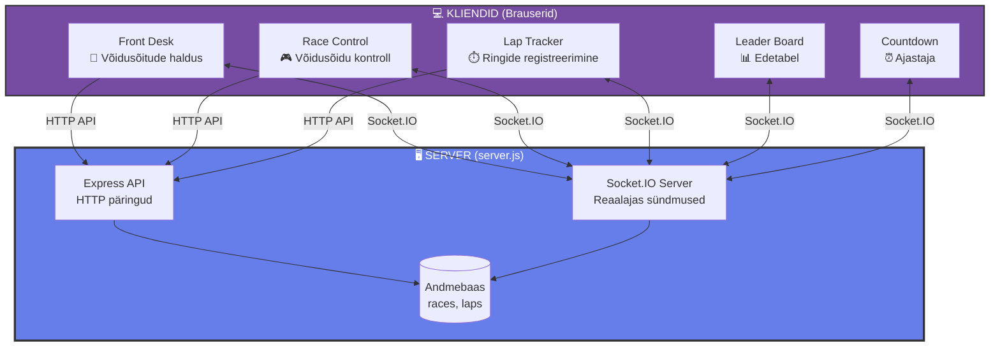
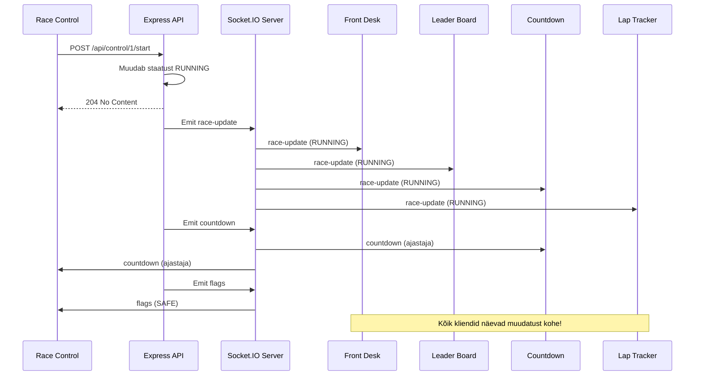
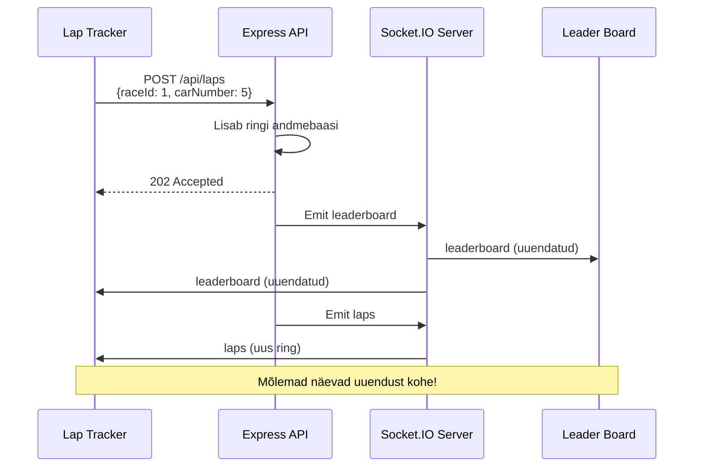
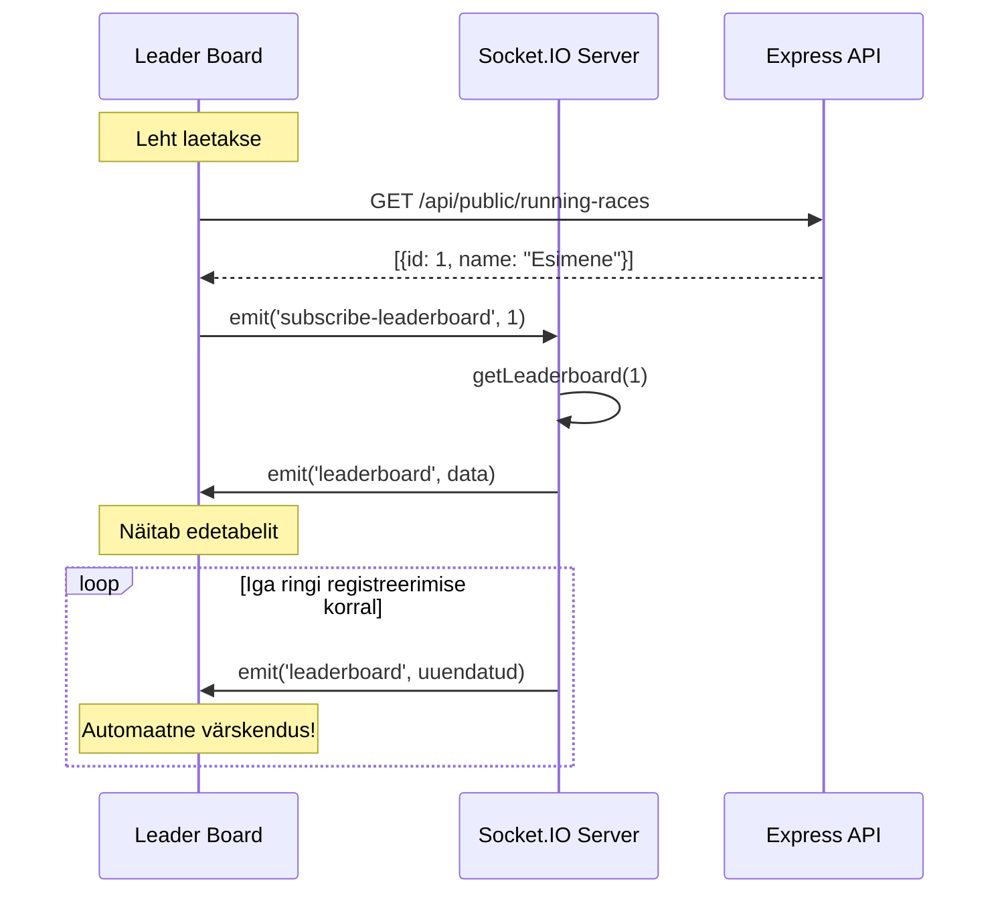
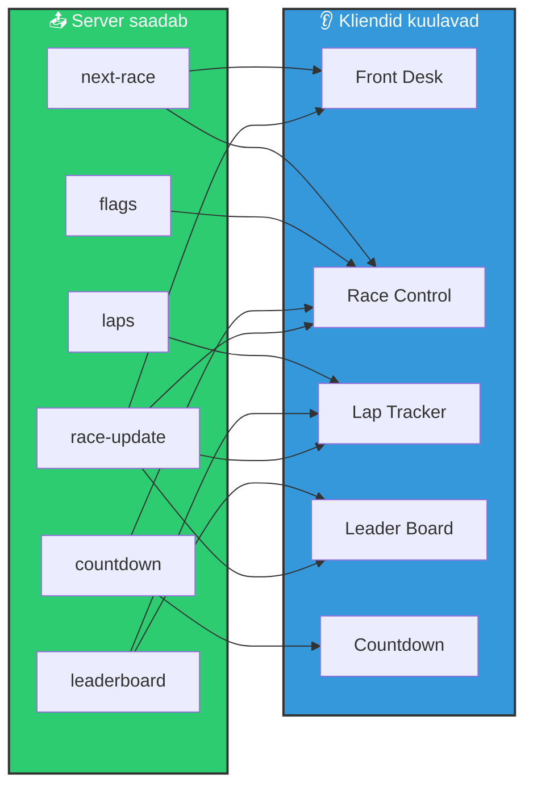

# Socket.IO Visuaalne Diagramm - Racetrack3

## Põhidiagramm



## Sündmuste voog - Võidusõidu alustamine



## Sündmuste voog - Ringi registreerimine



## Tellimise voog - Leader Board



## Sündmuste maatriks



## Reaalajas näide: Täielik voog

```mermaid
gantt
    title Võidusõit käib - Reaalajas sündmused
    dateFormat HH:mm:ss
    section Front Desk
    Võidusõit loodud    :00:00:00, 1s
    Sõitjad lisatud      :00:00:05, 3s
    section Race Control
    Võidusõit alustatud :00:00:10, 1s
    Režiim muudetud     :00:00:15, 1s
    section Lap Tracker
    Ring 1 registreeritud:00:00:20, 1s
    Ring 2 registreeritud:00:00:25, 1s
    Ring 3 registreeritud:00:00:30, 1s
    section Leader Board
    Automaatne värskendus:00:00:20, 15s
    section Countdown
    Ajastaja jookseb    :00:00:10, 60s
```



## Koodi struktuur

```mermaid
graph TD
    A[socket-client.js] -->|Loob ühenduse| B[socket = io()]
    B --> C[Front Desk]
    B --> D[Race Control]
    B --> E[Lap Tracker]
    B --> F[Leader Board]
    B --> G[Countdown]
    
    C -->|socket.on| C1[race-update]
    C -->|socket.on| C2[next-race]
    
    D -->|socket.on| D1[race-update]
    D -->|socket.on| D2[countdown]
    D -->|socket.on| D3[flags]
    D -->|socket.emit| D4[subscribe-countdown]
    
    E -->|socket.on| E1[race-update]
    E -->|socket.on| E2[leaderboard]
    E -->|socket.on| E3[laps]
    
    F -->|socket.on| F1[leaderboard]
    F -->|socket.on| F2[race-update]
    F -->|socket.emit| F3[subscribe-leaderboard]
    
    G -->|socket.on| G1[countdown]
    G -->|socket.on| G2[race-update]
    G -->|socket.emit| G3[subscribe-countdown]
    
    style A fill:#e74c3c,stroke:#333,stroke-width:3px,color:#fff
    style B fill:#2ecc71,stroke:#333,stroke-width:3px,color:#fff
```

## Kokkuvõte

**Socket.IO võimaldab:**
- ✅ **Reaalajas suhtlus** - Server saadab andmeid automaatselt
- ✅ **Automaatne sünkroniseerimine** - Kõik kliendid näevad samu andmeid
- ✅ **Mõnus kasutajakogemus** - Pole vaja lehte värskendada
- ✅ **Tõhus** - Vähem serveri koormust kui pidevate HTTP päringutega

**Meie projektis:**
- HTTP API kasutame **andmete muutmiseks** (POST, DELETE)
- Socket.IO kasutame **andmete vaatamiseks** (reaalajas värskendused)

