# Socket.IO Visuaalne Diagramm - Racetrack3

## Põhidiagramm

```mermaid
graph TB
    subgraph Server["🖥️ SERVER (server.js)"]
        API[Express API<br/>HTTP päringud]
        SOCKET[Socket.IO Server<br/>Reaalajas sündmused]
        DATA[(Andmebaas<br/>races, laps)]
    end
    
    subgraph Clients["💻 KLIENDID (Brauserid)"]
        FD[Front Desk<br/>📝 Võidusõitude haldus]
        RC[Race Control<br/>🎮 Võidusõidu kontroll]
        LT[Lap Tracker<br/>⏱️ Ringide registreerimine]
        LB[Leader Board<br/>📊 Edetabel]
        CD[Countdown<br/>⏰ Ajastaja]
    end
    
    %% Ühendused
    FD <-->|Socket.IO| SOCKET
    RC <-->|Socket.IO| SOCKET
    LT <-->|Socket.IO| SOCKET
    LB <-->|Socket.IO| SOCKET
    CD <-->|Socket.IO| SOCKET
    
    FD -->|HTTP API| API
    RC -->|HTTP API| API
    LT -->|HTTP API| API
    
    API --> DATA
    SOCKET --> DATA
    
    style Server fill:#667eea,stroke:#333,stroke-width:3px,color:#fff
    style Clients fill:#764ba2,stroke:#333,stroke-width:2px,color:#fff
```



## Sündmuste voog - Võidusõidu alustamine

```mermaid
sequenceDiagram
    participant RC as Race Control
    participant API as Express API
    participant SOCKET as Socket.IO Server
    participant FD as Front Desk
    participant LB as Leader Board
    participant CD as Countdown
    participant LT as Lap Tracker
    
    RC->>API: POST /api/control/1/start
    API->>API: Muudab staatust RUNNING
    API-->>RC: 204 No Content
    
    API->>SOCKET: Emit race-update
    SOCKET->>FD: race-update (RUNNING)
    SOCKET->>LB: race-update (RUNNING)
    SOCKET->>CD: race-update (RUNNING)
    SOCKET->>LT: race-update (RUNNING)
    
    API->>SOCKET: Emit countdown
    SOCKET->>CD: countdown (ajastaja)
    SOCKET->>RC: countdown (ajastaja)
    
    API->>SOCKET: Emit flags
    SOCKET->>RC: flags (SAFE)
    
    Note over FD,LT: Kõik kliendid näevad muudatust kohe!
```



## Sündmuste voog - Ringi registreerimine


## Tellimise voog - Leader Board

```mermaid
sequenceDiagram
    participant LB as Leader Board
    participant SOCKET as Socket.IO Server
    participant API as Express API
    
    Note over LB: Leht laetakse
    LB->>API: GET /api/public/running-races
    API-->>LB: [{id: 1, name: "Esimene"}]
    
    LB->>SOCKET: emit('subscribe-leaderboard', 1)
    SOCKET->>SOCKET: getLeaderboard(1)
    SOCKET->>LB: emit('leaderboard', data)
    
    Note over LB: Näitab edetabelit
    
    loop Iga ringi registreerimise korral
        SOCKET->>LB: emit('leaderboard', uuendatud)
        Note over LB: Automaatne värskendus!
    end
```



## Sündmuste maatriks


## Reaalajas näide: Täielik voog

```mermaid
gantt
    title Võidusõit käib - Reaalajas sündmused
    dateFormat HH:mm:ss
    section Front Desk
    Võidusõit loodud    :00:00:00, 1s
    Sõitjad lisatud      :00:00:05, 3s
    section Race Control
    Võidusõit alustatud :00:00:10, 1s
    Režiim muudetud     :00:00:15, 1s
    section Lap Tracker
    Ring 1 registreeritud:00:00:20, 1s
    Ring 2 registreeritud:00:00:25, 1s
    Ring 3 registreeritud:00:00:30, 1s
    section Leader Board
    Automaatne värskendus:00:00:20, 15s
    section Countdown
    Ajastaja jookseb    :00:00:10, 60s
```



## Koodi struktuur

```mermaid
graph TD
    A[socket-client.js] -->|Loob ühenduse| B[socket = io()]
    B --> C[Front Desk]
    B --> D[Race Control]
    B --> E[Lap Tracker]
    B --> F[Leader Board]
    B --> G[Countdown]
    
    C -->|socket.on| C1[race-update]
    C -->|socket.on| C2[next-race]
    
    D -->|socket.on| D1[race-update]
    D -->|socket.on| D2[countdown]
    D -->|socket.on| D3[flags]
    D -->|socket.emit| D4[subscribe-countdown]
    
    E -->|socket.on| E1[race-update]
    E -->|socket.on| E2[leaderboard]
    E -->|socket.on| E3[laps]
    
    F -->|socket.on| F1[leaderboard]
    F -->|socket.on| F2[race-update]
    F -->|socket.emit| F3[subscribe-leaderboard]
    
    G -->|socket.on| G1[countdown]
    G -->|socket.on| G2[race-update]
    G -->|socket.emit| G3[subscribe-countdown]
    
    style A fill:#e74c3c,stroke:#333,stroke-width:3px,color:#fff
    style B fill:#2ecc71,stroke:#333,stroke-width:3px,color:#fff
```

## Kokkuvõte

**Socket.IO võimaldab:**
- ✅ **Reaalajas suhtlus** - Server saadab andmeid automaatselt
- ✅ **Automaatne sünkroniseerimine** - Kõik kliendid näevad samu andmeid
- ✅ **Mõnus kasutajakogemus** - Pole vaja lehte värskendada
- ✅ **Tõhus** - Vähem serveri koormust kui pidevate HTTP päringutega

**Meie projektis:**
- HTTP API kasutame **andmete muutmiseks** (POST, DELETE)
- Socket.IO kasutame **andmete vaatamiseks** (reaalajas värskendused)

